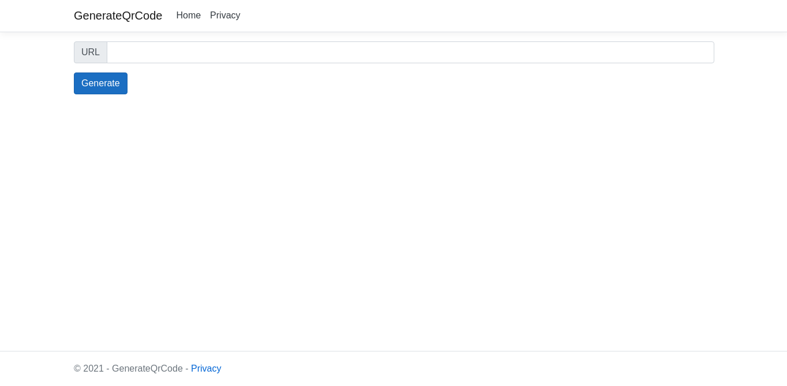

<h1 align="center">
    <a href="https://pt-br.reactjs.org/">🔗 Gerador de QrCode</a>
</h1>
<p align="center">🚀 Um gerador de QrCode, basta digitar uma url quee você terá seu QrCode</p>

<p align="center">
 <a href="#tecnologias">Tecnologias</a> • 
 <a href="#rodar">Rodar</a> • 
 <a href="#autor">Autor</a>
</p>

<h1 align="center">
  
</h1>

### Pré-requisitos

Antes de começar, você vai precisar ter instalado em sua máquina as seguintes ferramentas:
[Git](https://git-scm.com), [dotnet](https://dotnet.microsoft.com/). 
Além disto é bom ter um editor para trabalhar com o código como [VSCode](https://code.visualstudio.com/) e também utilize a extensão do [c#](https://www.omnisharp.net/).

### 🎲 Rodando o Back End (servidor)

```bash
# Clone este repositório
$ git clone <https://github.com/Bernardo01001/GeradorQrCode.git>

# Acesse a pasta do projeto no terminal/cmd
$ cd GeradorQrCode

# Instale a dependência
$ dotnet add package QRCoder

# Execute a aplicação
$ dotnet run

# O servidor inciará na porta:5001 - acesse <http://localhost:5001>
```

### 🛠 Tecnologias

As seguintes ferramentas foram usadas na construção do projeto:

- [dotnet](https://dotnet.microsoft.com/)
